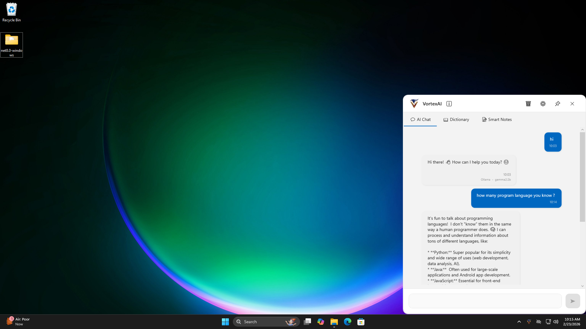
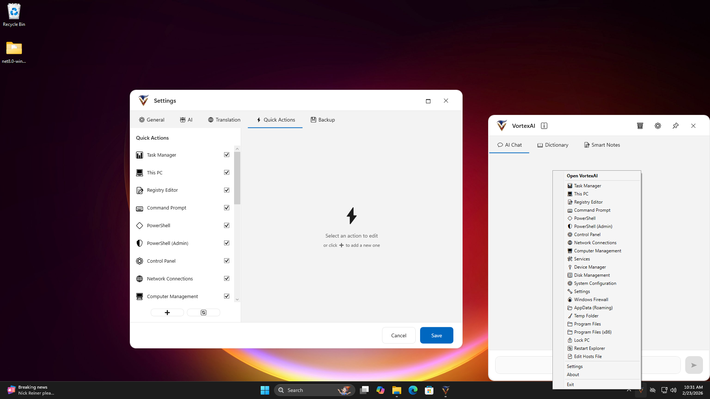

# VortexAI - Your Agent AI Assistant

<div align="center">


**A powerful, modern Windows desktop application that brings AI chat, translation, and smart notes to your fingertips.**

[](https://dotnet.microsoft.com/)
[](https://docs.microsoft.com/en-us/dotnet/desktop/wpf/)
[](LICENSE)

[Features](#features) • [Installation](#installation) • [Usage](#usage) • [AI Providers](#ai-providers) • [Screenshots](#screenshots)

</div>

---

## ✨ Features

### 🤖 AI Chat
- **Multiple AI Providers**: Support for OpenAI, Anthropic, Google Gemini, Groq, and local Ollama
- **Streaming Responses**: Real-time AI responses with typing indicators
- **Chat History**: Automatic saving and loading of conversations
- **Message Management**: Copy messages, clear history, and context-aware controls
- **Provider & Model Display**: See which AI provider and model generated each response

### 🌍 Translation Dictionary
- **50+ Languages**: Comprehensive language support including Arabic, Chinese, Japanese, and more
- **Quick Translation**: Instant translation with Enter key
- **Language Swap**: One-click language direction switching
- **Translation History**: Optional history saving with backup support
- **Context-Aware**: Separate history management from AI chat

### 📝 Smart Notes
- **Rich Text Editing**: Full-featured note editor with spell checking
- **Auto-Save**: Automatic saving with unsaved changes detection
- **Note Management**: Create, edit, delete, and organize notes
- **Search & Filter**: Quick note search functionality
- **Timestamps**: Automatic creation and modification tracking

### ⚡ Quick Actions
- **Customizable Shortcuts**: Create custom actions with emoji or custom icons
- **Global Hotkeys**: Trigger actions from anywhere in Windows
- **Tray Menu Integration**: Quick access from system tray
- **Action Types**: Support for URLs, file paths, and applications
- **Icon Customization**: Choose from emojis or custom image files

### 🎨 Modern UI/UX
- **Dark/Light Themes**: Beautiful theme system with smooth transitions
- **Fluent Design**: Modern Windows 11-style interface
- **Flexible Window**: Resizable, maximizable, with position memory
- **System Tray**: Minimize to tray with quick actions menu
- **Single Instance**: Prevents multiple app instances

### 🔧 Advanced Features
- **Backup & Restore**: Complete settings and data backup system
- **Startup Integration**: Optional Windows startup configuration
- **Ollama Integration**: Built-in local AI with automatic setup
- **Model Management**: Download and manage Ollama models from UI
- **Service Control**: Start, stop, and restart Ollama service
- **JSON/XML Formatter**: Built-in code formatting tools

---

## 📦 Installation

### Prerequisites
- **Windows 10/11** (64-bit)
- **.NET 8.0 Runtime** ([Download](https://dotnet.microsoft.com/en-us/download/dotnet/thank-you/runtime-desktop-8.0.24-windows-x64-installer))
- **Internet Connection** (for cloud AI providers)

### Quick Install

1. **Download** the latest release from [Releases](https://github.com/M-IT3/VortexAI/releases)
2. **Extract** the ZIP file to your preferred location
3. **Run** `VortexAI.exe`
4. **Configure** your AI provider in Settings

### Building from Source ** Soon **

```bash
# Clone the repository
git clone https://github.com/yourusername/VortexAI.git
cd VortexAI

# Build the project
dotnet build -c Release

# Run the application
dotnet run --project VortexAI.csproj
```

---

## 🚀 Usage

### First Launch

1. **Select AI Provider**: Choose from OpenAI, Anthropic, Google, Groq, or Ollama
2. **Enter API Key**: Add your API key for cloud providers (or install Ollama for local AI)
3. **Configure Settings**: Customize theme, window size, and preferences
4. **Start Chatting**: Begin your AI conversation!

### AI Chat

- Type your message and press **Enter** to send
- Use **Shift+Enter** for multi-line messages
- Click **Copy** button to copy AI responses
- Use **Clear History** to start fresh

### Translation

1. Switch to **Dictionary** tab
2. Select source and target languages
3. Type text and press **Enter**
4. Use **Swap** button to reverse language direction

### Quick Actions

1. Open **Settings** → **Quick Actions**
2. Click **Add Action**
3. Configure name, icon, and action (URL/file/app)
4. Set optional global hotkey
5. Access from tray menu or hotkey

### Ollama Setup (Local AI)

1. Select **Ollama** as provider in Settings
2. Click **Setup Ollama** button
3. App will install Ollama via winget
4. Download models from the models list
5. Activate your preferred model

---

## 🤖 AI Providers

### Supported Providers

| Provider | Models | API Key Required | Local |
|----------|--------|------------------|-------|
| **OpenAI** | GPT-4, GPT-3.5 | ✅ Yes | ❌ No |
| **Anthropic** | Claude 3 Opus, Sonnet, Haiku | ✅ Yes | ❌ No |
| **Google** | Gemini Pro, Flash | ✅ Yes | ❌ No |
| **Groq** | Llama 3, Mixtral, Gemma | ✅ Yes | ❌ No |
| **Ollama** | Llama 3, Gemma, Phi, Mistral | ❌ No | ✅ Yes |

### Getting API Keys

- **OpenAI**: [platform.openai.com](https://platform.openai.com/api-keys)
- **Anthropic**: [console.anthropic.com](https://console.anthropic.com/)
- **Google**: [makersuite.google.com](https://makersuite.google.com/app/apikey)
- **Groq**: [console.groq.com](https://console.groq.com/)

### Ollama (Local AI)

VortexAI includes built-in Ollama support for completely local AI:

- **No API Key**: Run AI models locally without internet
- **Privacy**: Your data never leaves your computer
- **Free**: No usage costs or rate limits
- **Auto-Setup**: One-click installation and configuration
- **Model Management**: Download and manage models from UI

---

## 🎨 Customization

### Themes
- **Dark Mode**: Modern dark theme for low-light environments
- **Light Mode**: Clean light theme for daytime use
- **Auto-Switch**: Themes apply instantly without restart

### Window Settings
- **Flexible Size**: Resize and maximize as needed
- **Position Memory**: Window remembers its last position
- **Always on Top**: Pin window option available

### Quick Actions
- **Custom Icons**: Use emojis or custom image files
- **Global Hotkeys**: Assign keyboard shortcuts
- **Tray Integration**: Access from system tray menu

---

## 📸 Screenshots

### AI Chat Interface


### Translation Dictionary


### Smart Notes


### Settings & Configuration


### Ollama Model Management


### Quick Actions Management

---

## 🛠️ Technical Details

### Architecture
- **Framework**: .NET 8.0 WPF
- **Pattern**: MVVM (Model-View-ViewModel)
- **DI**: Microsoft.Extensions.DependencyInjection
- **HTTP**: HttpClient with streaming support
- **Storage**: JSON-based local storage

### Key Technologies
- **WPF**: Modern Windows desktop UI
- **XAML**: Declarative UI markup
- **Async/Await**: Responsive async operations
- **Converters**: Custom value converters for UI binding
- **Services**: Modular service architecture


---

## 🔐 Privacy & Security

- **Local Storage**: All data stored locally in `%AppData%\VortexAI`
- **API Keys**: Encrypted storage of sensitive credentials
- **No Telemetry**: No usage tracking or analytics
- **Offline Mode**: Full functionality with Ollama (no internet required)
- **Open Source**: Transparent, auditable code

---

## 🤝 Contributing

Contributions are welcome! Please feel free to submit a Pull Request.

### Development Setup ** Soon ** 

1. Clone the repository
2. Open `VortexAI.sln` in Visual Studio 2022
3. Restore NuGet packages
4. Build and run

### Guidelines

- Follow existing code style and patterns
- Add XML documentation for public APIs
- Test thoroughly before submitting PR
- Update documentation as needed

---

## 📝 License

This project is licensed under the MIT License - see the [LICENSE](LICENSE) file for details.

---

## 🙏 Acknowledgments

- **OpenAI** - GPT models and API
- **Anthropic** - Claude AI models
- **Google** - Gemini AI models
- **Groq** - Fast inference API
- **Ollama** - Local AI runtime
- **LibreTranslate** - Free translation API

---

## 📧 Contact & Support

- **Issues**: [GitHub Issues](https://github.com/M-IT3/VortexAI/issues)
- **Discussions**: [GitHub Discussions](https://github.com/M-IT3/VortexAI/discussions)
- **Email**: VortexAI@Arabhd.net

---

<div align="center">

**Made with ❤️ for the AI community**

⭐ Star this repo if you find it useful!

</div>


